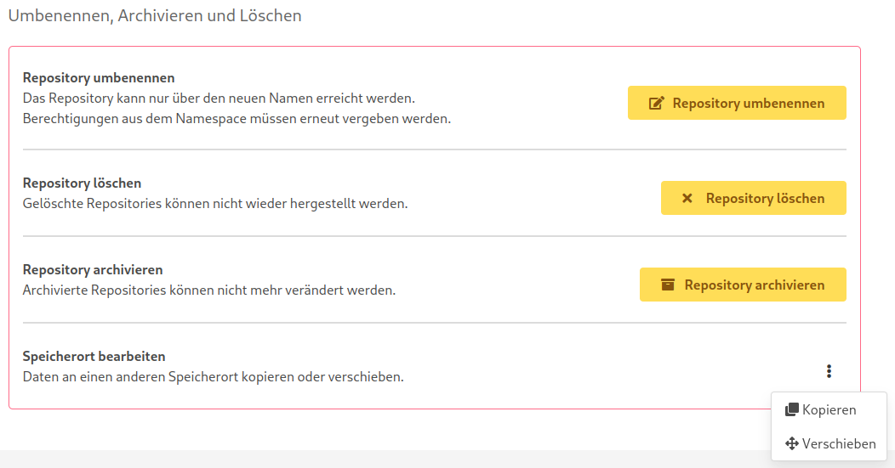
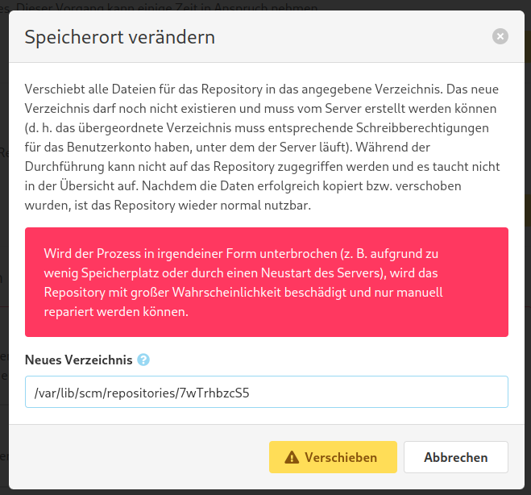
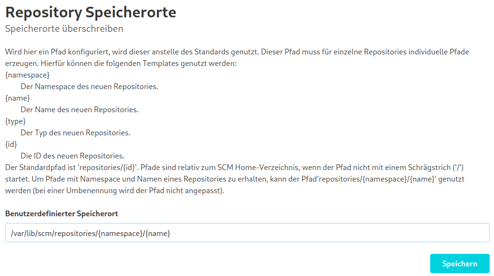
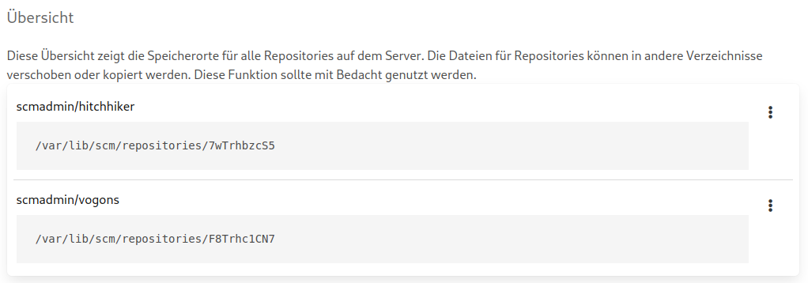

Standardmäßig werden die Daten für Repositories im SCM-Home-Verzeichnis unter ihrer ID gespeichert.
Mit dem Custom Storage Plugin ist es möglich, die Speicherpfade von bestehenden Repositories zu ändern und einen
benutzerdefinierten Pfad für neue Repositories anzugeben.

Pfade können in den Repository-Einstellungen oder in der globalen Übersicht geändert werden.

## Repository-Einstellungen

In den Einstellungen finden Sie einen neuen Eintrag am Ende für das Verschieben oder Kopieren der Repository-Daten.

Wenn Sie entweder "Verschieben" oder "Kopieren" auswählen, werden Sie nach dem neuen Pfad gefragt.

Der neue Pfad darf noch nicht existieren und muss vom Server erstellt werden können (d.h. der übergeordnete Pfad muss
entsprechende Schreibrechte für das Konto haben, unter dem der Serverprozess läuft). Sobald dies bestätigt ist, werden die
Repository-Daten an den neuen Speicherort verschoben oder kopiert. Während dieses Vorgangs wird das Repository aus der
Übersicht entfernt.
Wenn die Daten erfolgreich verschoben oder kopiert wurden, ist das Repository wieder verwendbar.

## Administrationseinstellungen

Im Administrationsbereich finden Sie einen neuen Navigationspunkt namens "Speicherorte".
Diese Ansicht ist in zwei Teile gegliedert: Oben können Sie den Speicherort für neue Repositories angeben, unten sehen Sie
alle vorhandenen Repositories und ihren aktuellen Speicherort.

### Benutzerdefinierter Speicherort

Um den Standard-Speicherort zu ändern, geben Sie einen neuen Pfad ein und klicken Sie auf "Speichern". Der neue Pfad
ist eine Vorlage mit verschiedenen Feldern, die auf der Seite dokumentiert sind.

### Pfadübersicht

Unterhalb dieser Einstellung finden Sie eine Liste mit allen vorhandenen Repositories und ihrem aktuellen Speicherort. Sie
können die Pfade genauso ändern wie in den Repository-Einstellungen.

