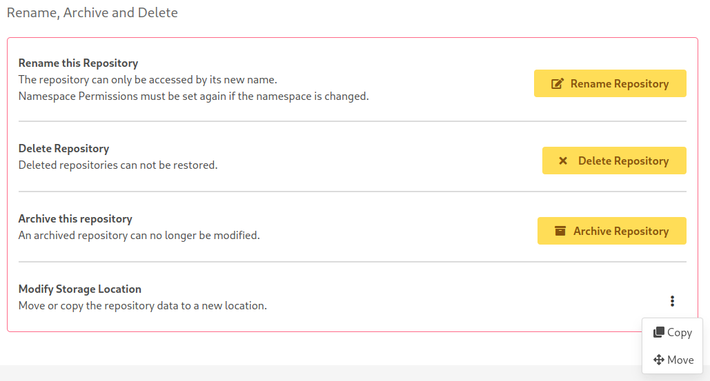
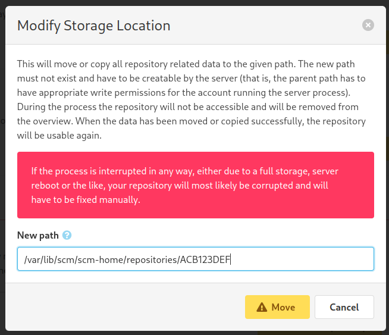
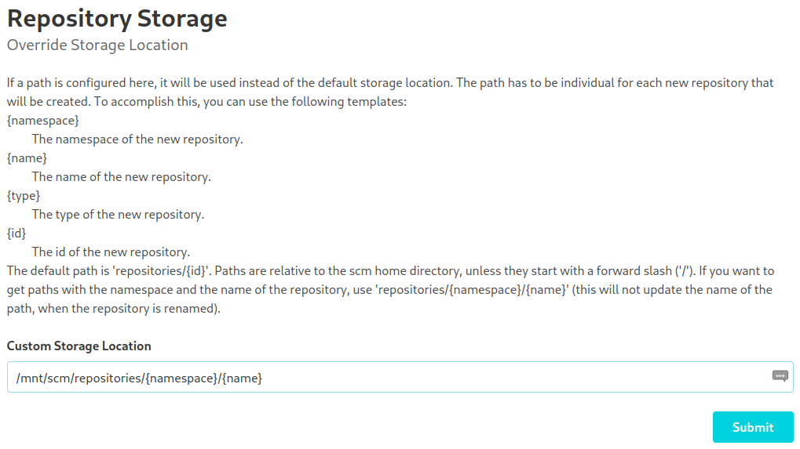
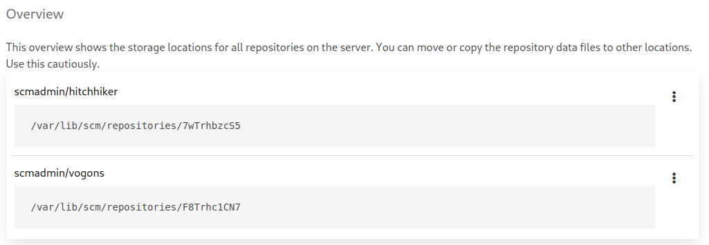

Normally, repositories are stored in directories in the SCM home under their id.
The Custom Storage Plugin provides the possibility to change these storage paths of existing repositories and specify a
custom path for new repositories.

Paths can be changed in the repository settings or in a global overview.

## Repository Settings

In the setting you will find a new entry at the bottom for either moving or copying the repository data.

If you select either "Move" or "Copy", you will be asked for the new path.

The new path must not yet exist and has to be creatable by the server (that is, the parent path has to have appropriate
write permissions for the account running the server process). Once confirmed, the repository data will be moved or copied
to the new location. During this process, the repository will be removed from the overview.
When the data has been moved or copied successfully, the repository will be usable again.

## Administration Settings

In the administration section, you will find a new navigation entry called "Storage". 
This view is split in two: On the top you can specify the storage path for new repositories, on the bottom you can see
all existing repositories and their current storage path.

### Custom Storage Path

To change the default storage path, just enter a new path and click "Submit". The new path is a template with different
fields, which are documented on the page.

### Path Overview

Beneath this setting, you will find a list with all existing repositories and their current storage path. You can change
the paths just like in the repository settings.

